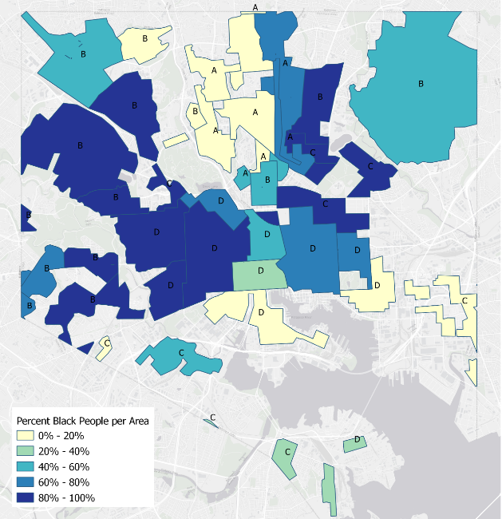
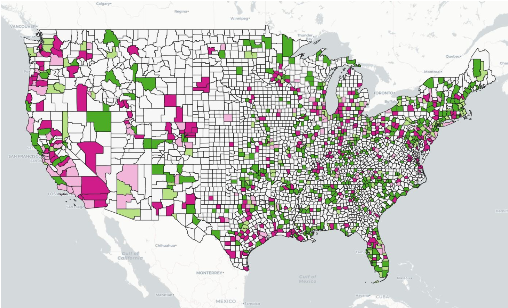
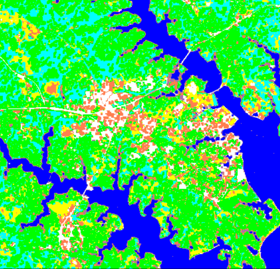
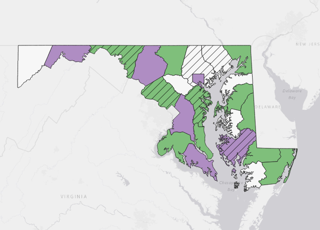

## Portfolio

---

### Undergraduate Projects

[The Impact of Historical Redlining in Baltimore City](/project2_486/redlining.md)

[Tweet Concentrations by US County - COVID-19 vs. Animal Crossing New Horizons](/twitter_map1/qgis2web_2020_03_26-16_56_10_627474)

[Seasonal Land Cover Changes in Annapolis, MD](/pdf/Figure1.pdf)

[Paranormal Activity by Maryland County](/project1_486/qgis2web_2020_03_09-18_41_00_422341)

[Pumpkin Growing Suitability in Rowan County, IL](/pdf/GES386_Practical.pdf)

[30-Year Land Cover Changes in the Chesapeake Bay Area](/pdf/GES381GroupProject.pdf)

---

Page template forked from <a href="https://github.com/evanca/quick-portfolio">evanca</a>

<!-- Remove above link if you don't want to attibute -->
