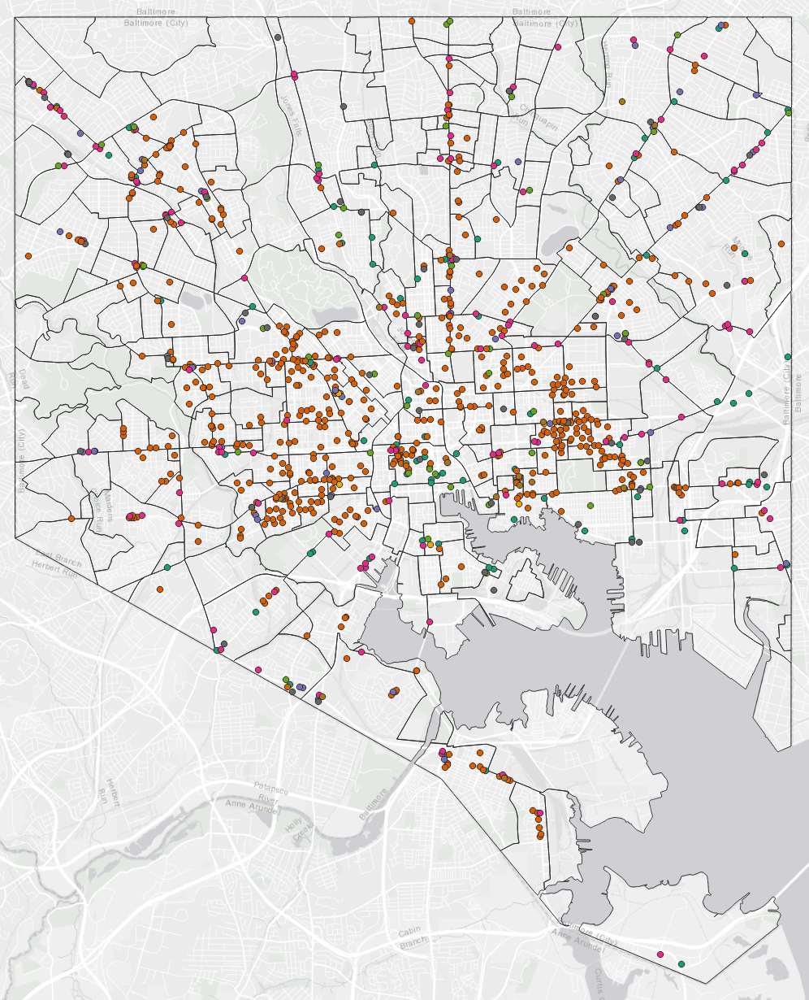

## Portfolio

---

### Undergraduate Projects

[Paranormal Activity by Maryland County](/project1_486/qgis2web_2020_03_09-18_41_00_422341)

[Seasonal Land Cover Changes in Annapolis, MD](/pdf/Figure1.pdf)

[Foodstores in Baltimore City](/foodstores_project/qgis2web_2020_02_13-16_15_36_117233)

[Pumpkin Growing Suitability in Rowan County, IL](/pdf/GES386_Practical.pdf)

[30-Year Land Cover Changes in the Chesapeake Bay Area](/pdf/GES381GroupProject.pdf)

---

Page template forked from <a href="https://github.com/evanca/quick-portfolio">evanca</a>

<!-- Remove above link if you don't want to attibute -->
