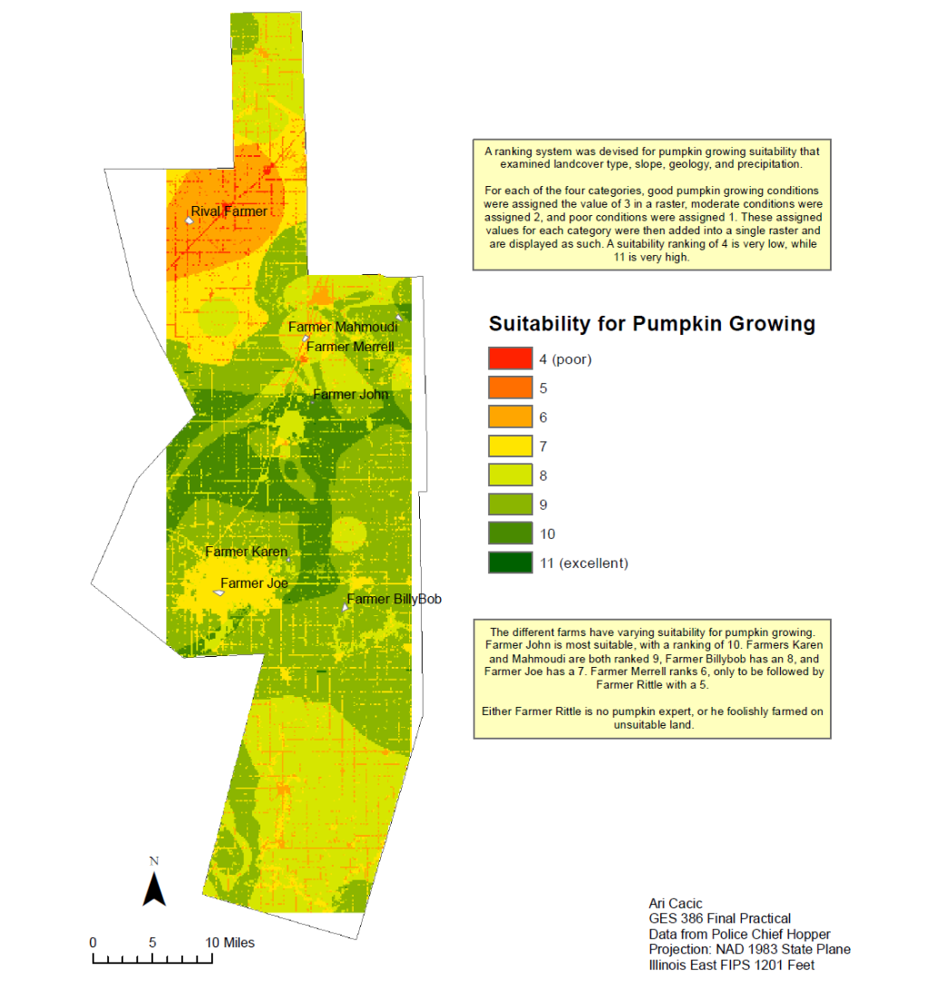
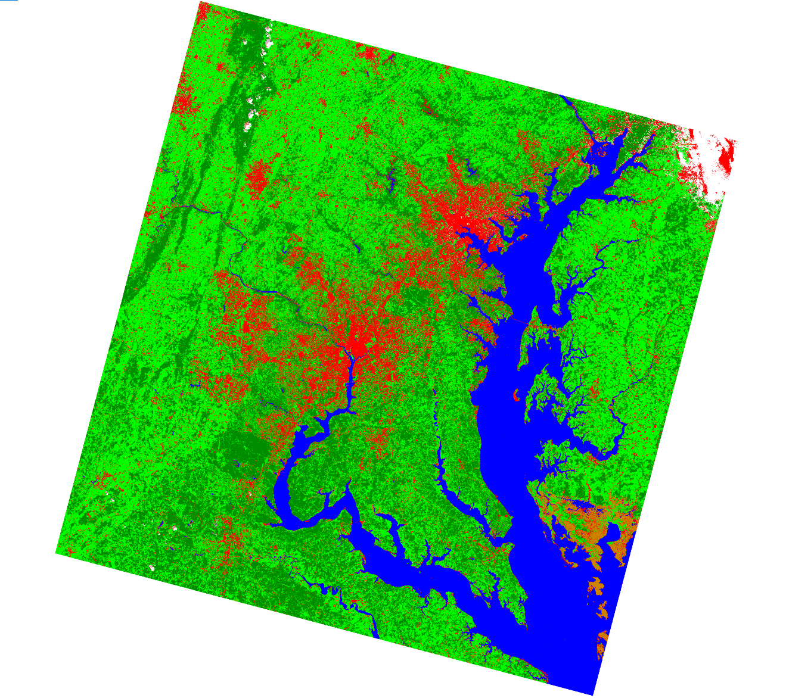

## Portfolio

---

### Undergraduate Projects

[Pumpkin Growing Suitability in Rowan County, IL](/pdf/GES386_Practical.pdf)

[Assessing Land Cover Changes in the Chesapeake Bay Area](/sample_page.md)

---

Page template forked from <a href="https://github.com/evanca/quick-portfolio">evanca</a>

<!-- Remove above link if you don't want to attibute -->
