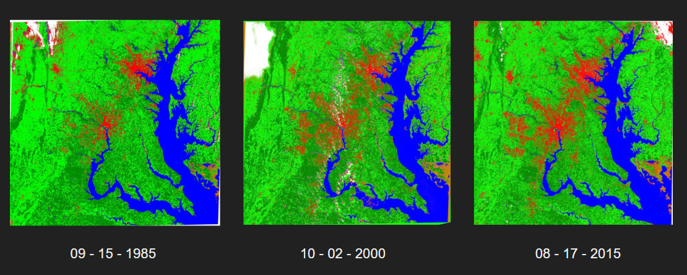

## Assessing Land Cover Changes in the Chesapeake Bay Area, full project by Ari Cacic, Leah Staub, Brad Weiss, and Kimberly Brackett

**Project description:** Land Cover maps were created of the Chesapeake Bay area from 1985, 2000, and 2015 in order to see how land use has changed in the region over the last 30 years. These maps were then compared to data on the Chesapeake Bay's health to see if there was any correlation between the Bay's quality and changes in the use of the surrounding land. 

### 1. Our Hypothesis and Data

Our team hypothesized an increase in urban and agricultural areas surrounding the Chesapeake Bay from 1985 to 2015. We expected to see a corresponding decrease in the health of the bay.

We used Landsat 5, 7, and 8 data from WRS Path 15 Row 33 to create our maps.

### 2. Results and Analysis

Blue = water, dark green = forests, light green = other vegetaion, orange = wetlands, red = urban, white = clouds, pink = cloud shadows. 

Using confusion matrices, we found that our maps were adequately accurate for the scope of our project. In analyzing the percentage of assigned pixels in each map, we found that net urban area increased slighly. However, agriculture, as a function of other vegetation, appeared to remain the same. Additionally, forests slightly decreased, and wetlands slightly increased. 

Regarding the health of the Bay, the Chesapeake Bay Report Card reported a slight increase in the Bay's health from 1985 to 2015. 

### 3. In Conclusion

Urbanization in the Chesapeake Bay area has slightly increased over the last 30 years. However, given that the health of the Bay has also increased, it is hard to draw any conclusions from our analysis. 
